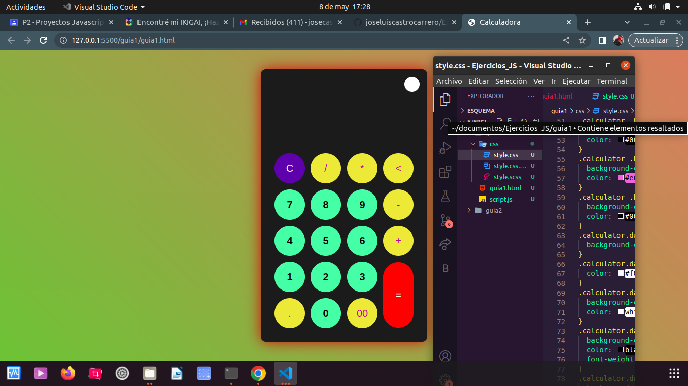

# EJERCICIOS VIDEO TUTORIAL

## CALCULADORA-EJERCICIO1
### En este procedimiento el html es como la estructura de la calculadora y el javascript le da el funcionamiento a la calculadora para que pueda resolver las operaciones 

# modelo principal

# segunda parte del modelo 

# tercera parte del modelo 

