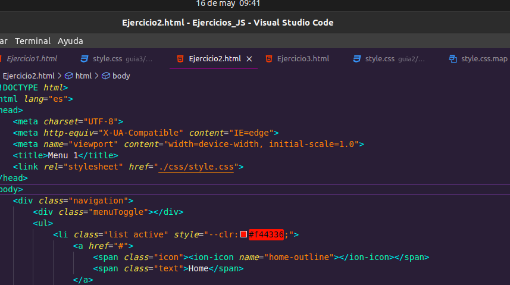
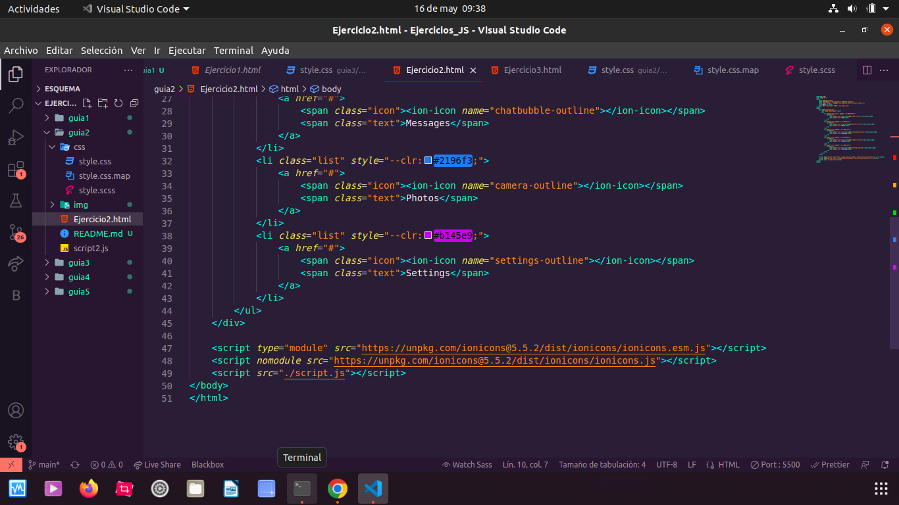
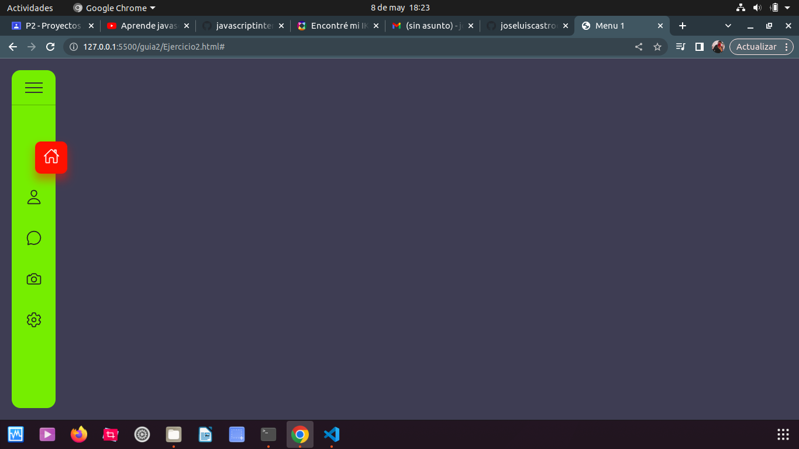

# EJECICIO 2

## MENU

### lo que trata este proyecto es que que cuando en el li class esta varible queda activa para que asi se muestre en la imagen

### tambien utilizamos ionicons para colocarlos los iconos de la pag para asi pueda obtener los iconos del menu 

