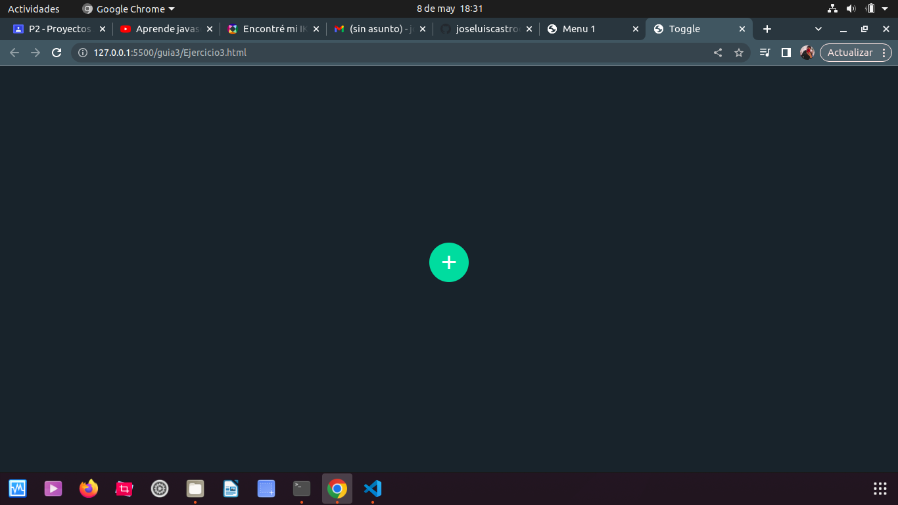
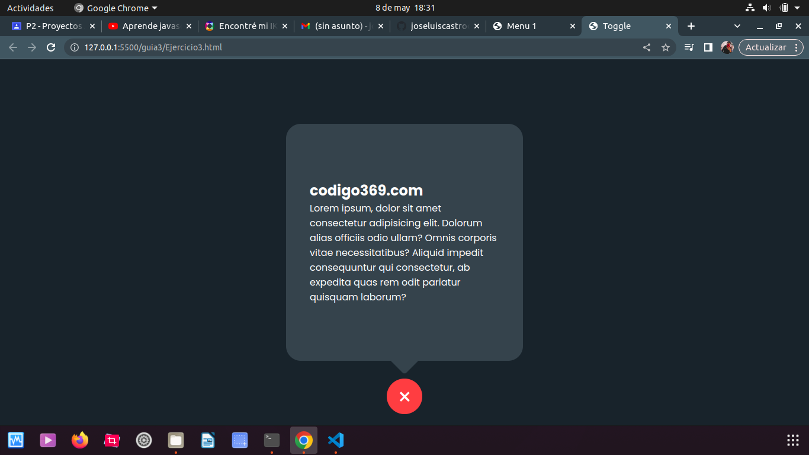

# Ejercicio 3

## toggle

### en este ejercicio o proyecto es la cual en html nos permite tener una mejor visibilidad ya que con el html podemos hacer como la maquetacion y en el css podemos diseñar para que en el js se pueda dar vida al proyecto o por decir mas claramente darle el funcionamiento para que podamos poner la imformacion en el html
 